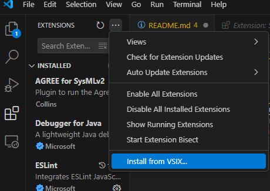
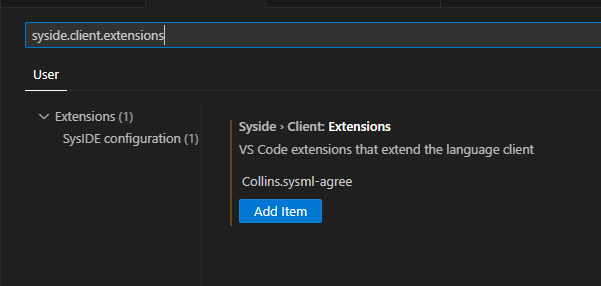

# AGREE for SysMLv2 extension

---

## Setup

1. Install the [SysIDE CE](https://marketplace.visualstudio.com/items?itemName=sensmetry.sysml-2ls) extension from the VSCode marketplace
2. Install Agree with CLI into an OSATE distribution.
3. Open VSCode, click on the extension tab, click the overflow menu button, and select "Intall from VSIX" 
4. Go into settings and enter `Collins.sysml-agree` into the `syside.client.extensions` list. 
5. The extension should be ready to use. Open a folder containing SysMLv2 models written using the AADL base class and follow the setup prompts. SysIDE will offer to download the SysMLv2 base libraries if you do not have them, and they will be stored in `$HOME/.sysml-2ls`. The translator JAR is in the bin folder

## Build instructions

TODO
